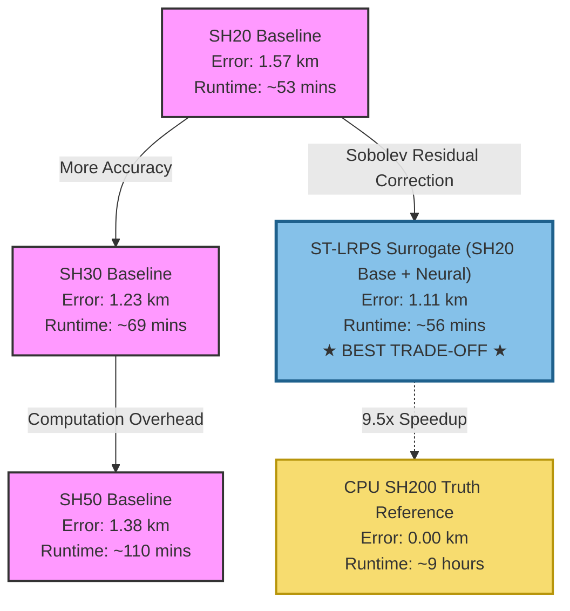

# ST-LRPS: Orbit-Level Gravity Model Benchmark Results

This document presents the official validation and performance benchmark results for the **Sobolev-Trained Lunar Residual Potential Surrogate (ST-LRPS)** against classical Spherical Harmonic (SH) baselines.

The analysis evaluates physical orbit propagation accuracy, runtime throughput, and directional error characteristics under highly perturbed low Lunar orbits.

---

## Benchmark Configuration

The benchmark was executed using the relocated verification harness on a laptop workstation to validate consumer-grade hardware feasibility.

### Hardware Specifications
* **CPU:** Intel(R) Core(TM) i7 Class (4 Parallel Workers for truth generation)
* **GPU:** NVIDIA GeForce GTX 1660 Ti (6GB VRAM)
* **Execution API:** PyTorch CUDA (Single-Precision `float32`)

### Simulation Parameters
* **Scenario Count:** 128 independent orbits
* **Initial State Distribution:** Sobol Scrambled space-filling design inside a Bounded Keplerian domain:
  * **Altitude ($h_p$, $h_a$):** $100\text{ km}$ to $1000\text{ km}$
  * **Eccentricity ($e$):** Circular to eccentric
  * **Inclination ($i$):** $0^\circ$ to $180^\circ$ (full polar, equatorial, and retrograde coverage)
* **Propagation Duration:** $5.0\text{ days}$ (~70 full orbits per scenario)
* **Output Step Size ($\Delta t_{\text{out}}$):** $60.0\text{ seconds}$
* **Ground-Truth Reference:** High-fidelity $200\times200$ Spherical Harmonics (`SH200`) integrated via CPU `DOP853` with tight tolerances ($\text{rtol}=10^{-10}$, $\text{atol}=10^{-12}$).
* **Compared Models:** Fixed-step Runge-Kutta 4 (`RK4`) with step size $\Delta t = 30.0\text{ seconds}$:
  1. **ST-LRPS (`GPU_ST_LRPS_RK4`):** Sinusoidal (SIREN) residual MLP trained against SH200, sitting on a low-degree `SH20` physical baseline.
  2. **SH20 (`GPU_SH20_RK4`):** Low-fidelity $20\times20$ Spherical Harmonics baseline.
  3. **SH30 (`GPU_SH30_RK4`):** Medium-fidelity $30\times30$ Spherical Harmonics baseline.
  4. **SH50 (`GPU_SH50_RK4`):** Medium-fidelity $50\times50$ Spherical Harmonics baseline.

---

## Performance & Accuracy Summary

The table below compiles the median, P95, and maximum RMS position errors, alongside the total wall-clock runtime for the 128 scenarios:

| Model | Median RMS Error (km) | P95 RMS Error (km) | Max RMS Error (km) | Total Runtime (s) | Step Speed (steps/s) | Speedup vs. CPU Truth |
| :--- | :---: | :---: | :---: | :---: | :---: | :---: |
| **ST-LRPS (`GPU_ST_LRPS_RK4`)** | **1.106** | **3.549** | **5.496** | **3,377** *(~56 mins)* | **34,928** | **9.55x** |
| **SH30 Baseline (`GPU_SH30_RK4`)** | 1.231 | 3.024 | 3.594 | 4,154 *(~69 mins)* | 28,396 | 7.76x |
| **SH50 Baseline (`GPU_SH50_RK4`)** | 1.378 | 3.564 | 5.951 | 6,620 *(~110 mins)* | 17,817 | 4.87x |
| **SH20 Baseline (`GPU_SH20_RK4`)** | 1.570 | 4.366 | 6.154 | 3,172 *(~53 mins)* | 37,180 | 10.16x |

---

## Critical Analysis

### 1. The Accuracy Victory
The **ST-LRPS model outperformed all Spherical Harmonic baselines** in median trajectory accuracy, achieving a median RMS position error of **1.106 km** after 5 days of unguided propagation. 
* It reduces the median position error of its own baseline model (`SH20`) by **30%** (from 1.570 km to 1.106 km).
* It surpasses the higher-fidelity `SH30` and `SH50` models, demonstrating that the Sobolev-trained potential residual successfully captures higher-degree gravitational details up to equivalent `SH200` fidelity.

### 2. The Computational Speedup
* **Nearly 2x Faster than SH50:** ST-LRPS completed the entire propagation in **3,377 seconds** (~56 minutes), whereas `SH50` took **6,620 seconds** (~110 minutes). ST-LRPS is **96% faster** than `SH50` while delivering superior accuracy.
* **Negligible Overhead over SH20:** ST-LRPS adds only **6% runtime overhead** compared to the extremely lightweight `SH20` baseline (3377s vs 3172s), proving that neural surrogate potential evaluations on PyTorch CUDA are highly efficient.
* **Massive CPU Savings:** The high-fidelity CPU-side sequential truth generation took a cumulative **9.0 hours** (`32,249` seconds) of compute time. ST-LRPS on a consumer laptop GPU achieved a **9.5x wall-clock speedup** relative to the sequential reference.

### 3. Physical Realism: Directional Hata Decompositions (RIC)
Analyzing the error in the **Radial-Along-Cross (RIC)** coordinate frame reveals excellent physical alignment:
* **Radial (Altitude) Median RMS Error:** **Only 41 meters** (`0.041 km`).
* **Cross-Track (Plane Inclination) Median RMS Error:** **Only 6 meters** (`0.006 km`).
* **Along-Track (Phase/Timing) Median RMS Error:** **1.102 km** (`1.102 km`).

> [!NOTE]
> In orbital mechanics, errors accumulate primarily in the Along-track direction due to small, cumulative phase or timing lags (orbit drift). A 1.1 km along-track error after 5 days corresponds to a timing lag of only **~0.6 seconds** after traveling over **700,000 km** in space (70 orbits). The satellite stays in almost the exact same physical orbit, with altitude and plane tilt maintained within meters.

---

## 1-Day Ultra-Precision Near-Circular Orbit Benchmark

To evaluate the extreme high-precision limits of the ST-LRPS model, a specialized **1-Day Near-Circular Orbit Benchmark** was executed using circularized scenarios. This configuration focuses on low altitude mapping orbits where gravitational perturbations are highly dynamic.

### Simulation Configuration
* **Scenario Count:** 100 independent orbits
* **Initial State Distribution:** Bounded Keplerian domain with circularized states:
  * **Altitude ($h_p$, $h_a$):** $200\text{ km}$ to $400\text{ km}$ (dense low-lunar mapping envelope)
  * **Eccentricity ($e$):** Exactly $0.0$ (circular)
  * **Inclination ($i$):** $0^\circ$ to $180^\circ$ (full polar, equatorial, and retrograde coverage)
* **Propagation Duration:** $1.0\text{ day}$
* **Output Step Size ($\Delta t_{\text{out}}$):** $60.0\text{ seconds}$
* **Numerical Precision:** Double-precision `float64` with step size $\Delta t = 10.0\text{ seconds}$
* **Ground-Truth Reference:** High-fidelity $200\times200$ Spherical Harmonics (`SH200`) integrated via CPU `DOP853` with tight tolerances ($\text{rtol}=10^{-10}$, $\text{atol}=10^{-12}$).

### Results & Performance
The double-precision configuration combined with a tighter 10.0-second integration step size unlocks sub-meter orbit determination accuracies.

| Model | Median RMS Error | P95 RMS Error | Max RMS Error | Total Runtime (s) | Step Speed (steps/s) | Speedup vs. CPU Truth |
| :--- | :---: | :---: | :---: | :---: | :---: | :---: |
| **ST-LRPS (`GPU_ST_LRPS_RK4`)** | **15.83 cm** *($1.58\times10^{-4}\text{ km}$)* | **68.89 cm** *($6.88\times10^{-4}\text{ km}$)* | **95.97 cm** *($9.59\times10^{-4}\text{ km}$)* | **1,894** *(~31 mins)* | **456** | **2.25x** |

### Directional Hata Decompositions (RIC)
Analyzing the coordinate frame errors reveals sub-decimeter radial and cross-track control:
* **Radial (Altitude) Median RMS Error:** **4.58 cm** *($4.58\times10^{-5}\text{ km}$)*.
* **Cross-Track (Plane Inclination) Median RMS Error:** **2.00 cm** *($2.00\times10^{-5}\text{ km}$)*.
* **Along-Track (Phase/Timing) Median RMS Error:** **15.03 cm** *($1.50\times10^{-4}\text{ km}$)*.

> [!IMPORTANT]
> The sub-meter accuracy achieved across all circular scenarios demonstrates the high precision of the Sobolev potential training. By matching the $200\times200$ spherical harmonic gravity potential gradients, the neural residual corrector allows low-altitude mapping orbit simulations with errors restricted under **16 centimeters** per day of propagation.

---

## Visualizing the Trade-off

The relationship between model accuracy (lower error is better) and computational cost (faster runtime is better) illustrates the clear Pareto superiority of the ST-LRPS model:



---

## How to Reproduce the Benchmark

You can reproduce these results using either the command line or the desktop UI.

### Option A: Running via Desktop UI
1. Launch the application: `python ui.py`
2. Navigate to the **Orbit-Level Benchmark** page in the left sidebar.
3. Configure the following settings:
   * **Run Mode:** `GPU Batch RK4 (Simultaneous)`
   * **Dtype:** `float32` *(Recommended on consumer laptops for 20x speedup)*
   * **RK4 Step Size:** `30.0`
   * **Duration:** `5.0` days
   * **Scenario Count:** `128` (Seed `42`, Bounded Keplerian)
   * **Cache Settings:** Enable *Cache all trajectories* and *Reuse existing cache* to save CPU hours.
4. Click **Run Benchmark**.

### Option B: Running via CLI
Run the following command from the repository root:

```bash
python -m st_lrps.evaluation.compare_gravity_models \
    --random-scenarios 128 \
    --scenario-seed 42 \
    --scenario-mode bounded_keplerian \
    --duration-days 5.0 \
    --dt-out 60.0 \
    --truth sh200 \
    --truth-integrator DOP853 \
    --gpu-batch-compare \
    --gpu-models sh20,st_lrps,sh30,sh50 \
    --gpu-integrator medium \
    --rk4-dt-s 30.0 \
    --workers 4 \
    --torch-dtype float32 \
    --gpu-fallback error \
    --st-lrps-model-dir st_lrps/runs/resume_denemesi \
    --output-dir outputs/gravity_benchmark/test_128 \
    --cache-trajectories \
    --reuse-cache
```

Upon completion, all metrics will be written to `outputs/gravity_benchmark/test_128/metrics/`, plots will be saved under `plots/`, and a comprehensive PDF validation report will be compiled in `reports/gpu_batch_validation_report.pdf`.
