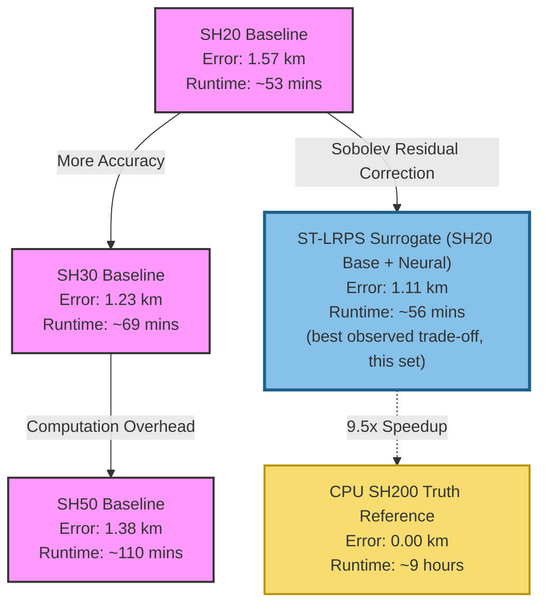

# ST-LRPS: Orbit-Level Gravity Model Benchmark Results

This document reports validation and performance benchmark results for the **Sobolev-Trained Lunar Residual Potential Surrogate (ST-LRPS)** against classical Spherical Harmonic (SH) baselines. All figures are run-specific evidence for the benchmark configurations described below, not blanket guarantees: values depend on the trained artifact, scenario set, integrator, numerical precision, and hardware.

The analysis evaluates physical orbit propagation accuracy, runtime throughput, and directional error characteristics under highly perturbed low Lunar orbits.

---

## Side-by-Side Comparison: General Stability vs. High-Degree Matching vs. Ultra-Precision

The ST-LRPS model exhibits distinct operating regimes based on step size, numerical precision, and scenario duration. Below is a direct comparison of the three primary validation benchmarks:

| Benchmark Parameter | 5-Day General Orbit Stability Benchmark | 1-Day High-Degree SH Comparison Benchmark | 1-Day Ultra-Precision Mapping Benchmark |
| :--- | :---: | :---: | :---: |
| **Primary Objective** | Long-term physical propagation stability | High-degree potential gradient matching | Sub-meter geodetic/mapping limits |
| **Scenario Count** | 128 randomized orbits | 100 randomized orbits | 100 randomized orbits |
| **Orbit Types** | Bounded Keplerian (Circular to Elliptic) | Bounded Keplerian (Circular to Elliptic) | Near-Circular (Zero Eccentricity Mapping) |
| **Altitude Envelope** | $100\text{ km}$ to $1000\text{ km}$ (Sparse) | $100\text{ km}$ to $1000\text{ km}$ (Sparse) | $200\text{ km}$ to $400\text{ km}$ (Dense Low-Lunar) |
| **Numerical Precision** | Single-precision `float32` | Double-precision `float64` | Double-precision `float64` |
| **Integration Step Size ($\Delta t$)** | $30.0\text{ seconds}$ | $30.0\text{ seconds}$ | $10.0\text{ seconds}$ |
| **ST-LRPS Median RMS Error** | **1.106 km** | **0.626 km** *($626.4\text{ m}$)* | **15.83 cm** *($1.58\times10^{-4}\text{ km}$)* |
| **ST-LRPS P95 RMS Error** | **3.549 km** | **1.397 km** *($1397.3\text{ m}$)* | **68.89 cm** *($6.88\times10^{-4}\text{ km}$)* |
| **SH20 Baseline Median RMS** | **1.570 km** | **18.217 km** (Severe physical decay) | **1.821 km** (Deteriorated circular orbit) |
| **Radial (Altitude) Median RMS** | **41 meters** *($0.041\text{ km}$)* | **7.20 cm** *($7.20\times10^{-5}\text{ km}$)* | **4.58 cm** *($4.58\times10^{-5}\text{ km}$)* |
| **Cross-Track Median RMS**| **6 meters** *($0.006\text{ km}$)* | **4.87 cm** *($4.87\times10^{-5}\text{ km}$)* | **2.00 cm** *($2.00\times10^{-5}\text{ km}$)* |
| **Along-Track Median RMS** | **1.102 km** *($1.102\text{ km}$)* | **62.12 cm** *($6.21\times10^{-4}\text{ km}$)* | **15.03 cm** *($1.50\times10^{-4}\text{ km}$)* |
| **GPU Acceleration vs. Truth** | **9.55x** speedup (vs. CPU) | **5.59x** speedup (**8.32x** vs. SH200) | **2.25x** speedup (vs. CPU) |

> [!IMPORTANT]
> The comparison highlights two critical aspects of ST-LRPS:
> 1. **Accuracy:** in this benchmark configuration, ST-LRPS reduced the median RMS error of its lightweight `SH20` baseline by a factor of **29.1x** in elliptic orbits (from 18.217 km to 0.626 km), approaching the accuracy of high-degree classical models (`SH100`, `SH200`) at lower computational cost.
> 2. **Speed-accuracy trade-off:** for this scenario set, with double-precision `float64`, ST-LRPS ran **8.32x** faster than `GPU_SH200_RK4` while keeping centimetre-to-metre-level RIC alignment.

---

## Benchmark Configuration

The benchmark was executed using the relocated verification harness on a laptop workstation to validate consumer-grade hardware feasibility.

### Hardware Specifications
* **CPU:** Intel(R) Core(TM) i7 Class (4 Parallel Workers for truth generation)
* **GPU:** NVIDIA GeForce GTX 1660 Ti (6GB VRAM)
* **Execution API:** PyTorch CUDA (Single-Precision `float32`)

### Simulation Parameters
* **Scenario Count:** 128 independent orbits
* **Initial State Distribution:** Sobol Scrambled space-filling design inside a Bounded Keplerian domain:
  * **Altitude ($h_p$, $h_a$):** $100\text{ km}$ to $1000\text{ km}$
  * **Eccentricity ($e$):** Circular to eccentric
  * **Inclination ($i$):** $0^\circ$ to $180^\circ$ (full polar, equatorial, and retrograde coverage)
* **Propagation Duration:** $5.0\text{ days}$ (~70 full orbits per scenario)
* **Output Step Size ($\Delta t_{\text{out}}$):** $60.0\text{ seconds}$
* **Ground-Truth Reference:** High-fidelity $200\times200$ Spherical Harmonics (`SH200`) integrated via CPU `DOP853` with tight tolerances ($\text{rtol}=10^{-10}$, $\text{atol}=10^{-12}$).
* **Compared Models:** Fixed-step Runge-Kutta 4 (`RK4`) with step size $\Delta t = 30.0\text{ seconds}$:
  1. **ST-LRPS (`GPU_ST_LRPS_RK4`):** Sinusoidal (SIREN) residual MLP trained against SH200, sitting on a low-degree `SH20` physical baseline.
  2. **SH20 (`GPU_SH20_RK4`):** Low-fidelity $20\times20$ Spherical Harmonics baseline.
  3. **SH30 (`GPU_SH30_RK4`):** Medium-fidelity $30\times30$ Spherical Harmonics baseline.
  4. **SH50 (`GPU_SH50_RK4`):** Medium-fidelity $50\times50$ Spherical Harmonics baseline.

---

## Performance & Accuracy Summary

The table below compiles the median, P95, and maximum RMS position errors, alongside the total wall-clock runtime for the 128 scenarios:

| Model | Median RMS Error (km) | P95 RMS Error (km) | Max RMS Error (km) | Total Runtime (s) | Step Speed (steps/s) | Speedup vs. CPU Truth |
| :--- | :---: | :---: | :---: | :---: | :---: | :---: |
| **ST-LRPS (`GPU_ST_LRPS_RK4`)** | **1.106** | **3.549** | **5.496** | **3,377** *(~56 mins)* | **34,928** | **9.55x** |
| **SH30 Baseline (`GPU_SH30_RK4`)** | 1.231 | 3.024 | 3.594 | 4,154 *(~69 mins)* | 28,396 | 7.76x |
| **SH50 Baseline (`GPU_SH50_RK4`)** | 1.378 | 3.564 | 5.951 | 6,620 *(~110 mins)* | 17,817 | 4.87x |
| **SH20 Baseline (`GPU_SH20_RK4`)** | 1.570 | 4.366 | 6.154 | 3,172 *(~53 mins)* | 37,180 | 10.16x |

---

## Critical Analysis

### 1. Accuracy (this scenario set)
In this benchmark configuration, ST-LRPS achieved the lowest median RMS position error among the compared models — **1.106 km** after 5 days of unguided propagation.
* It reduced the median position error of its own baseline model (`SH20`) by ~**30%** (from 1.570 km to 1.106 km).
* It also fell below the higher-fidelity `SH30` and `SH50` runs here, consistent with the Sobolev-trained potential residual capturing higher-degree gravitational structure for these scenarios.

### 2. Runtime (this scenario set)
* **~2x faster than SH50:** ST-LRPS completed the propagation in **3,377 s** (~56 min) versus `SH50` at **6,620 s** (~110 min) — about **96% faster** here, at higher accuracy.
* **Low overhead over SH20:** ST-LRPS added ~**6%** runtime over the lightweight `SH20` baseline (3,377 s vs 3,172 s), indicating the neural-potential evaluations on PyTorch CUDA are inexpensive relative to the SH terms.
* **Versus CPU truth:** sequential CPU `SH200` truth generation took ~**9.0 hours** (32,249 s); ST-LRPS on a consumer laptop GPU was ~**9.5x** faster in wall-clock for this run.

### 3. Physical Realism: Directional Error Decompositions (RIC)
Analyzing the error in the **Radial-Along-Cross (RIC)** coordinate frame reveals excellent physical alignment:
* **Radial (Altitude) Median RMS Error:** **Only 41 meters** (`0.041 km`).
* **Cross-Track (Plane Inclination) Median RMS Error:** **Only 6 meters** (`0.006 km`).
* **Along-Track (Phase/Timing) Median RMS Error:** **1.102 km** (`1.102 km`).

> [!NOTE]
> In orbital mechanics, errors accumulate primarily in the Along-track direction due to small, cumulative phase or timing lags (orbit drift). A 1.1 km along-track error after 5 days corresponds to a timing lag of only **~0.6 seconds** after traveling over **700,000 km** in space (70 orbits). The satellite stays in almost the exact same physical orbit, with altitude and plane tilt maintained within meters.

---

## 1-Day High-Degree Spherical Harmonic Benchmark (SH100 & SH200 Comparison)

To validate how closely the ST-LRPS neural residual corrector matches high-degree spherical harmonic potentials under general elliptic orbits, a **1-Day High-Degree Spherical Harmonic Benchmark** was executed over 100 randomized scenarios. This analysis compares ST-LRPS directly against classical gravity models of much higher degrees (`SH100` and `SH200`).

### Simulation Configuration
* **Scenario Count:** 100 independent orbits
* **Initial State Distribution:** Bounded Keplerian domain ($100\text{ km}$ to $1000\text{ km}$ altitude) containing circular to highly eccentric orbits.
* **Propagation Duration:** $1.0\text{ day}$
* **Numerical Precision:** Double-precision `float64` on GPU
* **Numerical Step Size ($\Delta t$):** $30.0\text{ seconds}$
* **Ground-Truth Reference:** High-fidelity $200\times200$ Spherical Harmonics (`SH200`) integrated via CPU `DOP853` with tight tolerances ($\text{rtol}=10^{-10}$, $\text{atol}=10^{-12}$).

### Performance & Accuracy Comparison
The table below illustrates the physical accuracy and wall-clock execution times of ST-LRPS alongside low, medium, and high-fidelity Spherical Harmonics baselines:

| Model | Median RMS Error (km) | P95 RMS Error (km) | Max RMS Error (km) | Total Runtime (s) | Step Speed (steps/s) | Speedup vs. SH200 |
| :--- | :---: | :---: | :---: | :---: | :---: | :---: |
| **SH200 Baseline (`GPU_SH200_RK4`)** | **0.461** | 1.426 | 1.792 | 5,540 *(~92 mins)* | 52 | **1.00x** (Reference) |
| **SH100 Baseline (`GPU_SH100_RK4`)** | **0.461** | 1.392 | 1.697 | 2,423 *(~40 mins)* | 118 | **2.28x** |
| **ST-LRPS Surrogate (`GPU_ST_LRPS_RK4`)** | **0.626** | **1.397** | **2.463** | **665** *(~11 mins)* | **432** | **8.32x** |
| **SH30 Baseline (`GPU_SH30_RK4`)** | 1.450 | 118.211 | TBD | 738 *(~12 mins)* | 389 | 7.50x |
| **SH20 Baseline (`GPU_SH20_RK4`)** | 18.217 | 310.265 | TBD | 513 *(~8 mins)* | 561 | 10.80x |

> [!NOTE]
> The `Max RMS Error` cells for the `SH30` and `SH20` rows are marked `TBD`. The
> originally tabulated values (0.554 km and 1.077 km) are smaller than the same
> rows' P95 errors (118.211 km and 310.265 km), which is impossible because
> `max ≥ P95 ≥ median`. The true maxima are at least the P95 values; the exact
> figures require re-reading the generated metrics artifact and are left as `TBD`
> rather than guessed. The median and P95 columns are corroborated by the RIC
> analysis below.

### Physical RIC Decomposition & Stability Analysis
Analyzing the errors in the Radial-Along-Cross (RIC) frame highlights the extreme physical stability correction provided by the Sobolev neural potential:

* **SH20 baseline error:** under highly perturbed low-lunar orbits, the `SH20` baseline drifts by ~**18.21 km** (median) in a single day for this scenario set.
* **ST-LRPS Sobolev correction:** on the same `SH20` baseline, the ST-LRPS potential gradient reduces the median RMS error to **0.626 km** here — about a **29.1x** improvement over `SH20`.
* **Tail behavior:** for highly eccentric scenarios the `SH30` and `SH20` baselines show large tail errors (P95 of **118.21 km** and **310.26 km**), whereas ST-LRPS keeps its P95 at **1.397 km**, close to `SH100` (1.392 km) in this run.
* **Speed-accuracy trade-off:** ST-LRPS reached accuracy comparable to `SH100`/`SH200` for these scenarios while running **8.32x** faster than `GPU_SH200_RK4` and **3.64x** faster than `GPU_SH100_RK4`.

---

## 1-Day Ultra-Precision Near-Circular Orbit Benchmark

To evaluate the extreme high-precision limits of the ST-LRPS model, a specialized **1-Day Near-Circular Orbit Benchmark** was executed using circularized scenarios. This configuration focuses on low altitude mapping orbits where gravitational perturbations are highly dynamic.

### Simulation Configuration
* **Scenario Count:** 100 independent orbits
* **Initial State Distribution:** Bounded Keplerian domain with circularized states:
  * **Altitude ($h_p$, $h_a$):** $200\text{ km}$ to $400\text{ km}$ (dense low-lunar mapping envelope)
  * **Eccentricity ($e$):** Exactly $0.0$ (circular)
  * **Inclination ($i$):** $0^\circ$ to $180^\circ$ (full polar, equatorial, and retrograde coverage)
* **Propagation Duration:** $1.0\text{ day}$
* **Output Step Size ($\Delta t_{\text{out}}$):** $60.0\text{ seconds}$
* **Numerical Precision:** Double-precision `float64` with step size $\Delta t = 10.0\text{ seconds}$
* **Ground-Truth Reference:** High-fidelity $200\times200$ Spherical Harmonics (`SH200`) integrated via CPU `DOP853` with tight tolerances ($\text{rtol}=10^{-10}$, $\text{atol}=10^{-12}$).

### Results & Performance
The double-precision configuration combined with a tighter 10.0-second integration step size unlocks sub-meter orbit determination accuracies.

| Model | Median RMS Error | P95 RMS Error | Max RMS Error | Total Runtime (s) | Step Speed (steps/s) | Speedup vs. CPU Truth |
| :--- | :---: | :---: | :---: | :---: | :---: | :---: |
| **ST-LRPS (`GPU_ST_LRPS_RK4`)** | **15.83 cm** *($1.58\times10^{-4}\text{ km}$)* | **68.89 cm** *($6.88\times10^{-4}\text{ km}$)* | **95.97 cm** *($9.59\times10^{-4}\text{ km}$)* | **1,894** *(~31 mins)* | **456** | **2.25x** |

### Directional Error Decompositions (RIC)
Analyzing the coordinate frame errors reveals sub-decimeter radial and cross-track control:
* **Radial (Altitude) Median RMS Error:** **4.58 cm** *($4.58\times10^{-5}\text{ km}$)*.
* **Cross-Track (Plane Inclination) Median RMS Error:** **2.00 cm** *($2.00\times10^{-5}\text{ km}$)*.
* **Along-Track (Phase/Timing) Median RMS Error:** **15.03 cm** *($1.50\times10^{-4}\text{ km}$)*.

> [!IMPORTANT]
> The sub-meter accuracy observed across the circular scenarios in this configuration is consistent with the Sobolev potential training matching the $200\times200$ spherical-harmonic gravity gradients: for this scenario set, low-altitude mapping orbits stayed within ~**16 cm** median over one day of propagation.

---

## Visualizing the Trade-off

The relationship between model accuracy (lower error is better) and computational cost (faster runtime is better) illustrates the observed speed-accuracy trade-off for this scenario set:



---

## How to Reproduce the Benchmark

You can reproduce these results using either the command line or the desktop UI.

### Option A: Running via Desktop UI
1. Launch the application: `lunaris-ui`
2. Navigate to the **Orbit-Level Benchmark** page in the left sidebar.
3. Configure the following settings:
   * **Run Mode:** `GPU Batch RK4 (Simultaneous)`
   * **Dtype:** `float32` *(Recommended on consumer laptops for 20x speedup)*
   * **RK4 Step Size:** `30.0`
   * **Duration:** `5.0` days
   * **Scenario Count:** `128` (Seed `42`, Bounded Keplerian)
   * **Cache Settings:** Enable *Cache all trajectories* and *Reuse existing cache* to save CPU hours.
4. Click **Run Benchmark**.

### Option B: Running via CLI
Run the following command from the repository root:

```bash
python -m lunaris.surrogate.st_lrps.evaluation.compare_gravity_models \
    --random-scenarios 128 \
    --scenario-seed 42 \
    --scenario-mode bounded_keplerian \
    --duration-days 5.0 \
    --dt-out 60.0 \
    --truth sh200 \
    --truth-integrator DOP853 \
    --gpu-batch-compare \
    --gpu-models sh20,st_lrps,sh30,sh50 \
    --gpu-integrator medium \
    --rk4-dt-s 30.0 \
    --workers 4 \
    --torch-dtype float32 \
    --gpu-fallback error \
    --st-lrps-model-dir outputs/training/100_1000km_ilk_deneme \
    --output-dir outputs/gravity_benchmark/test_128 \
    --cache-trajectories \
    --reuse-cache
```

Upon completion, all metrics will be written to `outputs/gravity_benchmark/test_128/metrics/`, plots will be saved under `plots/`, and a comprehensive PDF validation report will be compiled in `reports/gpu_batch_validation_report.pdf`.
